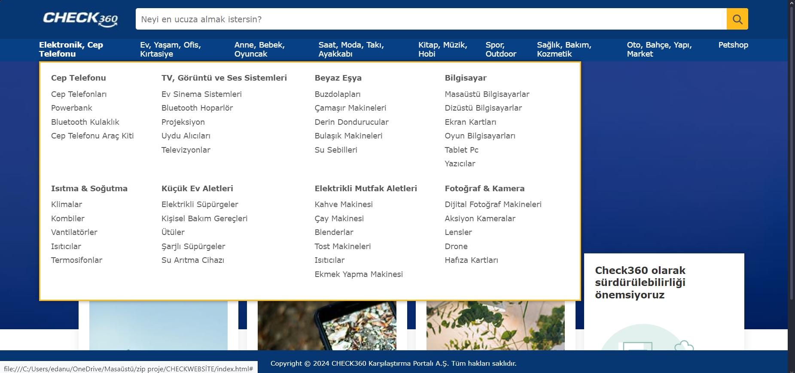
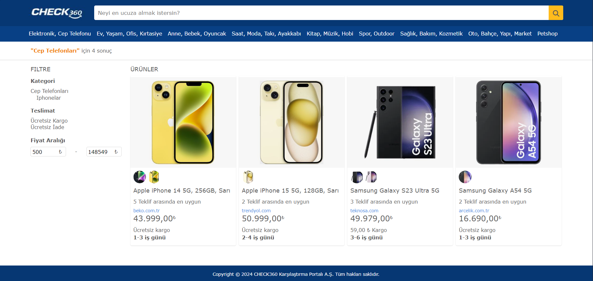
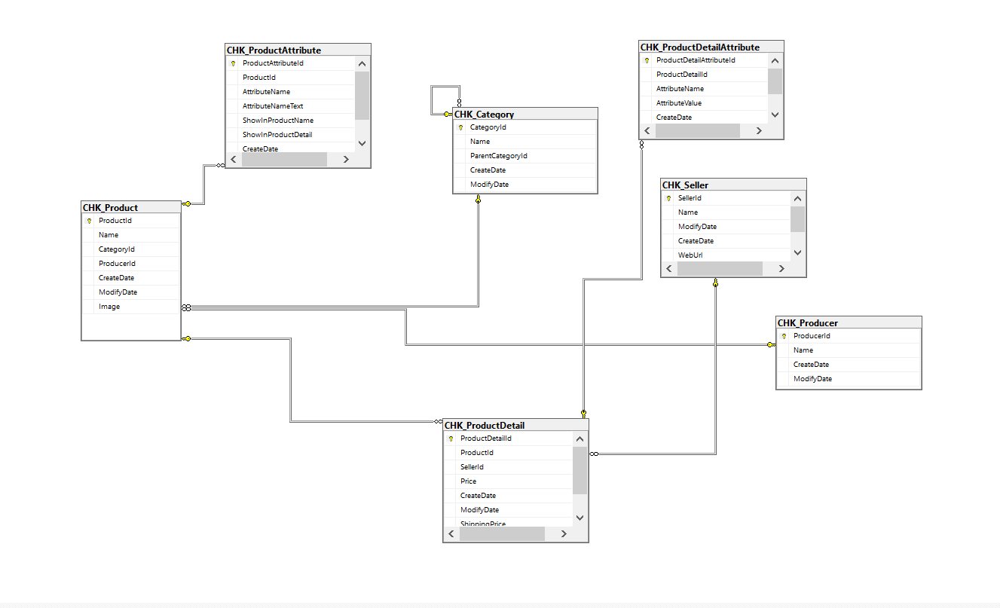
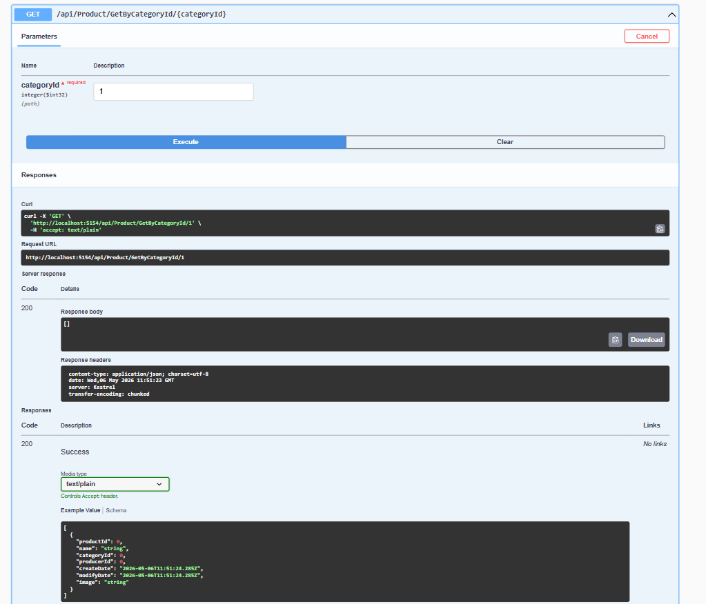
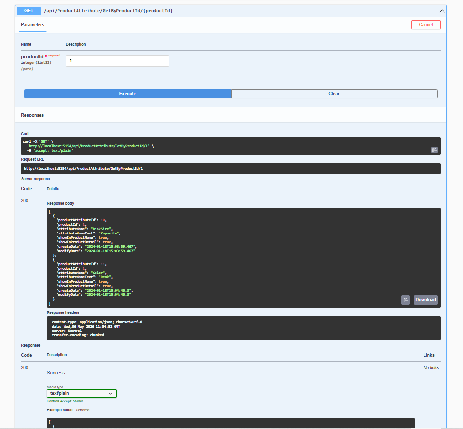
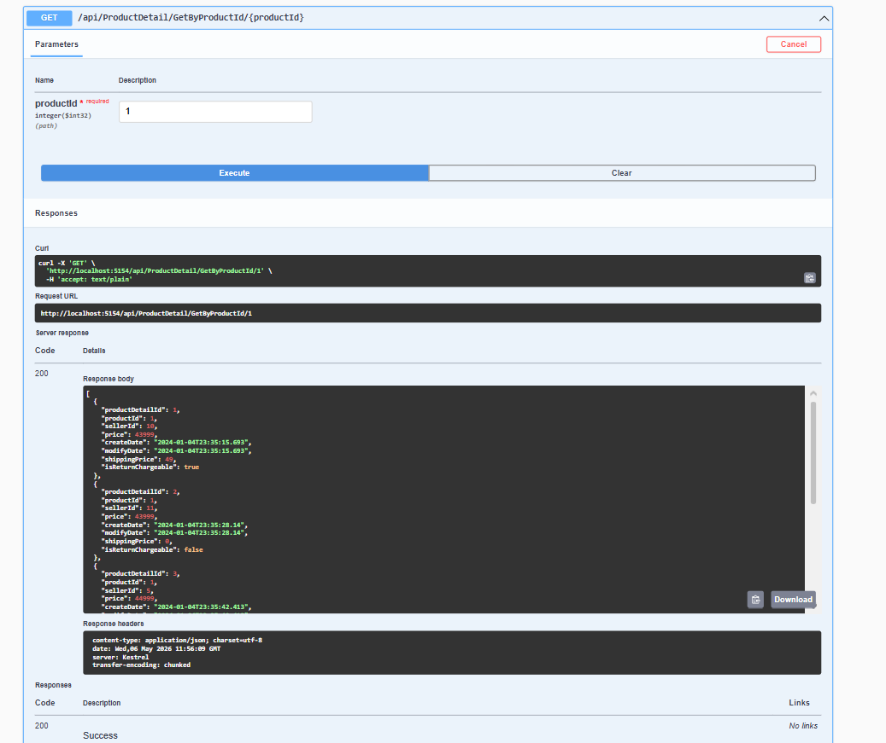
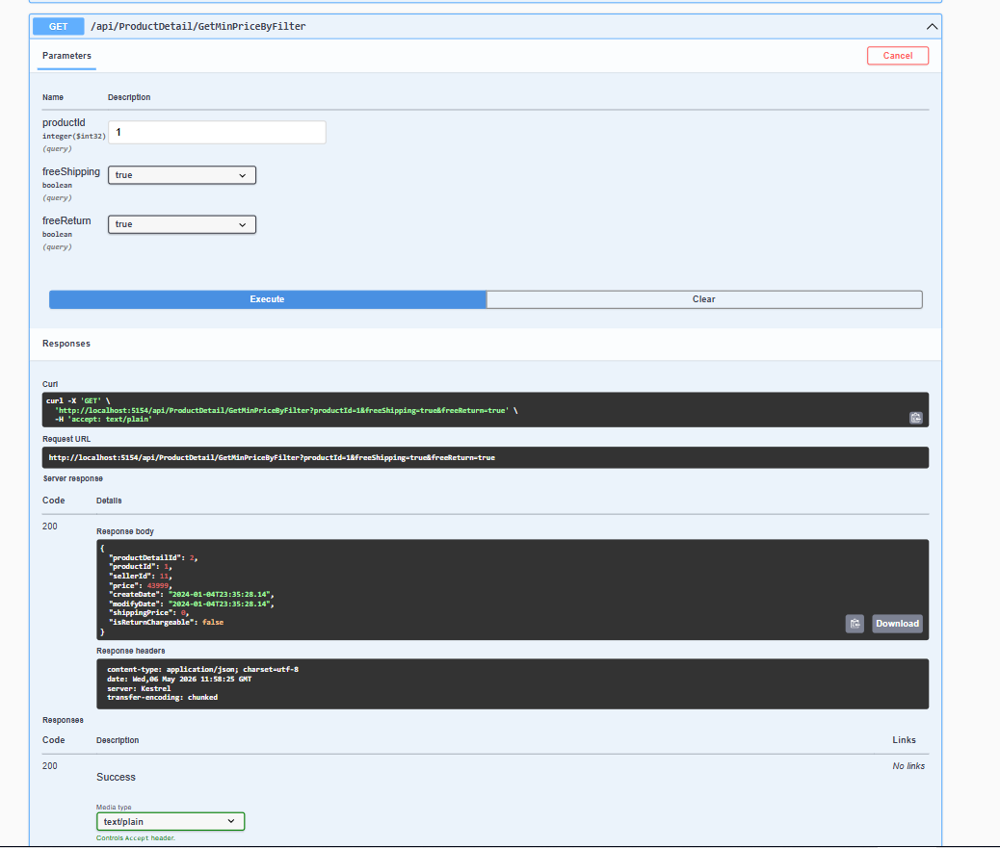
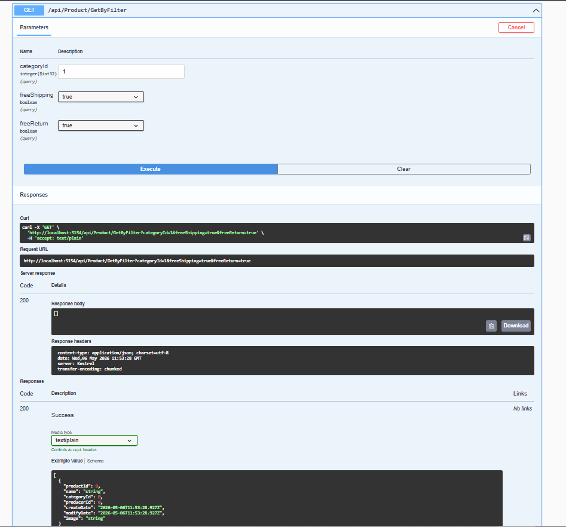
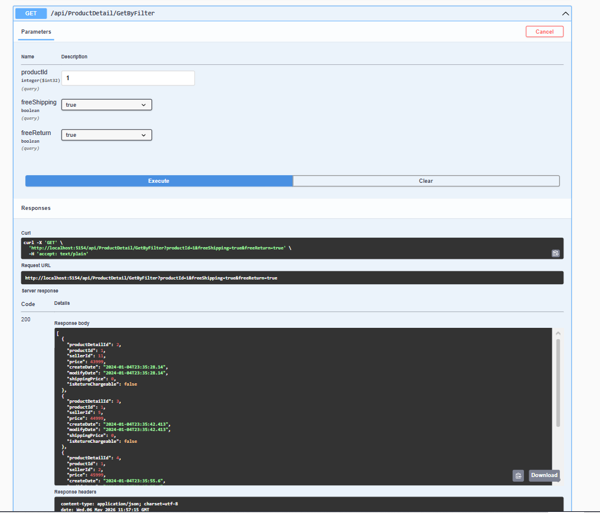

## 📌 Project Overview

This project is a Price Comparison API that allows users to compare products across multiple sellers.

The system is designed to:
- Manage products and categories
- Store multiple seller offers for each product
- Provide filtering and comparison features
- Return the cheapest product dynamically

The architecture separates:
- Product (main entity)
- ProductDetail (seller-specific offers)

- ## 🖥️ Application Preview

### 🏠 Homepage

---

### 📦 Product Listing

---

### 💰 Price Comparison (Offers)

- ## 🧠 System Design

The system is built on a layered architecture:

- Controller Layer → Handles HTTP requests
- Service Layer → Business logic
- Data Access Layer → Database operations

Key Design Decisions:
- Product and ProductDetail are separated
- Supports multi-seller structure
- Filter-based querying
- Scalable API design

## 🗄️ Database Design

The database follows a relational structure:

- Category → hierarchical structure (parent-child)
- Product → main product entity
- Producer → brand
- ProductDetail → seller-specific offers
- ProductAttribute → general attributes
- ProductDetailAttribute → seller-specific attributes
- Seller → vendors

### ER Diagram

## 🔌 API Documentation

The backend is built using **ASP.NET Core Web API** and follows RESTful principles.
Below are the main endpoints grouped by entity, including custom business logic endpoints.

---

## 📂 Category

### Standard Endpoints

* `GET /api/Category`
  → Returns all categories

* `GET /api/Category/{id}`
  → Returns category by ID

* `POST /api/Category`
  → Creates a new category

* `PUT /api/Category/{id}`
  → Updates an existing category

* `DELETE /api/Category/{id}`
  → Deletes a category

### 🔥 Custom Endpoint

* `GET /api/Category/GetByParentId/{parentId}`
  → Returns subcategories of a given category
  → Used for dynamic menu generation (hierarchical structure)

---

## 🏷️ Producer

* `GET /api/Producer`
* `GET /api/Producer/{id}`
* `POST /api/Producer`
* `PUT /api/Producer/{id}`
* `DELETE /api/Producer/{id}`

→ Manages product brands (Apple, Samsung, etc.)

---

## 📦 Product

### Standard Endpoints

* `GET /api/Product`
* `GET /api/Product/{id}`
* `POST /api/Product`
* `PUT /api/Product/{id}`
* `DELETE /api/Product/{id}`

### 🔥 Custom Endpoints

* `GET /api/Product/GetByCategoryId/{categoryId}`
  → Returns products filtered by category
  → Used in product listing page

* `GET /api/Product/GetByFilter`
  → Returns products based on filter parameters
  → Supports advanced filtering (category, brand, etc.)

---

## 🧾 ProductAttribute

### Standard Endpoints

* `GET /api/ProductAttribute`
* `GET /api/ProductAttribute/{id}`
* `POST /api/ProductAttribute`
* `PUT /api/ProductAttribute/{id}`
* `DELETE /api/ProductAttribute/{id}`

### 🔥 Custom Endpoint

* `GET /api/ProductAttribute/GetByProductId/{productId}`
  → Returns general attributes of a product
  → Example: RAM, Color, Storage

---

## 💰 ProductDetail (Core Comparison Logic)

### Standard Endpoints

* `GET /api/ProductDetail`
* `GET /api/ProductDetail/{id}`
* `POST /api/ProductDetail`
* `PUT /api/ProductDetail/{id}`
* `DELETE /api/ProductDetail/{id}`

### 🔥 Custom Endpoints

* `GET /api/ProductDetail/GetByProductId/{productId}`
  → Returns all offers for a product
  → Each offer represents a different seller

* `GET /api/ProductDetail/GetByFilter`
  → Filters offers based on price, shipping, return options

* `GET /api/ProductDetail/GetMinPriceByFilter`
  → Returns the cheapest offer for a product
  → Core feature of price comparison logic

---

## ⚙️ ProductDetailAttribute

### Standard Endpoints

* `GET /api/ProductDetailAttribute`
* `GET /api/ProductDetailAttribute/{id}`
* `POST /api/ProductDetailAttribute`
* `PUT /api/ProductDetailAttribute/{id}`
* `DELETE /api/ProductDetailAttribute/{id}`

### 🔥 Custom Endpoint

* `GET /api/ProductDetailAttribute/GetByProductDetailId/{productDetailId}`
  → Returns seller-specific attributes
  → Example: Delivery time, energy class

---

## 🏪 Seller

* `GET /api/Seller`
* `GET /api/Seller/{id}`
* `POST /api/Seller`
* `PUT /api/Seller/{id}`
* `DELETE /api/Seller/{id}`

→ Represents vendors (Amazon, Trendyol, etc.)

---

## 🧠 API Design Highlights

* RESTful architecture
* Separation of concerns (Product vs ProductDetail)
* Hierarchical data handling (Category)
* Filter-based querying
* Multi-seller comparison logic

---

## 📸 API Testing (Swagger)

All endpoints are tested using Swagger UI.

### 🧠 API Behavior Example

The following screenshots demonstrate:

- Multi-seller price comparison
- Dynamic filtering
- Minimum price detection

## 📸 Screenshots

### Product Controller
Basic CRUD operations for product management.

---

### Product Attribute Controller
Manages general product attributes such as RAM, color, and storage.

---

### Price Comparison (Multi-Seller Offers)
Displays all seller offers for a product, enabling price comparison.

---

### Minimum Price Detection
Identifies the cheapest offer among all sellers.

---

### Product Filtering
Filters offers based on parameters such as free shipping and return options.

---

### Filtered Offers Result
Shows filtered results based on selected criteria.

---

### Product Detail Attributes
Displays seller-specific attributes such as delivery time and extra details.

## ⚙️ Technologies

- ASP.NET Core Web API
- Entity Framework Core
- MSSQL
- Swagger (OpenAPI)

- ## 🚀 Getting Started

1. Clone the repository:
   git clone https://github.com/username/repo.git

2. Open project in Visual Studio

3. Update connection string in appsettings.json

4. Run the project

5. Navigate to:
   https://localhost:{port}/swagger

   ## 🧠 Key Features

- Multi-seller product comparison
- Dynamic filtering
- Minimum price calculation
- Hierarchical category structure
